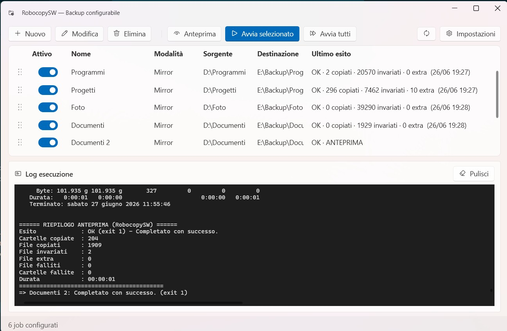
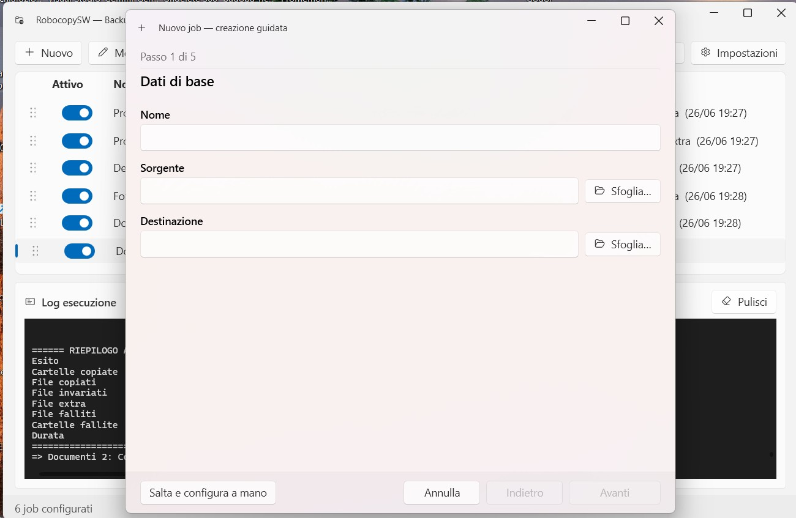
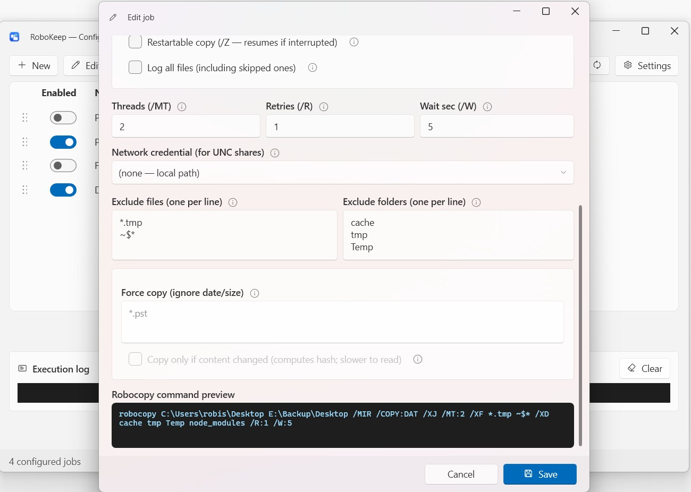

# RoboKeep

*Read in: English · [Italiano](readmeita.md)*

**A modern GUI for `robocopy`: simple, transparent, and reliable backup and mirroring on Windows.**


[](LICENSE)

RoboKeep puts a modern graphical interface and centralized configuration on top of `robocopy`, Windows'
built-in copy tool: define your backup jobs (source → destination) once, and run them manually, from the
command line, or on a schedule — without writing or maintaining scripts by hand.



*Job list with the latest result at a glance and a real-time execution log.*

## Why RoboKeep

- **Proven engine, not reinvented.** Copying is handled by Windows `robocopy`: fast, multi-threaded,
  reliable, and always up to date with the system. RoboKeep adds convenience and clarity on top — no new
  copy algorithm to blindly trust.
- **Fully transparent.** The editor shows, in real time, the **exact robocopy command** that will be
  executed. No black box — you always know what's happening.
- **Single configuration.** All jobs in one JSON file, editable from the GUI, instead of hand-written and
  duplicated scripts.
- **Guided creation.** A wizard asks a few questions (disk types, behavior, special files) and **sets the
  optimal options**, avoiding common robocopy mistakes.
- **Local, free, no cloud.** No telemetry, no account. Network-share credentials are encrypted with
  Windows DPAPI.
- **Portable.** App, configuration, and logs all in the same folder — copy the folder and everything moves
  with you.
- **Multilingual:** Italian, English, Spanish, French, German.

## How a backup works

For each job (source → destination pair, recursive over subfolders):

- **skips** identical files (same last-modified date/time and size);
- **overwrites** destination files when the source is newer;
- in **mirror** mode (`/MIR`, default) it **removes** from the destination files/folders that no longer exist in the source;
- with mirror disabled (`/E`) it only copies and updates, **never deletes**.

## Requirements

- **Windows 10 or 11** (uses the system `robocopy`).
- **.NET 10 Desktop Runtime** — needed **only** for the *framework-dependent* download; the
  *self-contained* download bundles .NET (10.0.9) and requires nothing extra. The **.NET 10 SDK** is only
  needed to build from source.

## Installation

### Option A — Ready-to-use release (recommended)

1. Download the latest version from the project's **[Releases](../../releases)** page. Two builds are available:
   - **`…-selfcontained.zip`** — bundles **.NET 10.0.9**: just extract and run, **nothing to install** (larger download).
   - **`…-framework-dependent.zip`** — small download, but requires the
     **[.NET 10 Desktop Runtime](https://dotnet.microsoft.com/download/dotnet/10.0)**.
2. Extract the `.zip` into a **writable folder** (e.g. `D:\Programs\RoboKeep`).
   > Avoid `C:\Program Files` (read-only for standard users): if you put it there, set writable log/temp
   > paths in Settings.
3. Run **`RoboKeep.exe`**. No installation required — the app is portable.

If you used the framework-dependent build and Windows reports a missing runtime, install the
[.NET 10 Desktop Runtime](https://dotnet.microsoft.com/download/dotnet/10.0) and try again.

### Option B — Build from source

```powershell
git clone https://github.com/robisera-ai/RoboKeep.git
cd RoboKeep
dotnet build src/RoboKeep.sln -c Release
dotnet test  src/RoboKeep.Tests/RoboKeep.Tests.csproj   # optional
# executable at: src/RoboKeep/bin/Release/net10.0-windows/RoboKeep.exe
```

## Usage

### Graphical interface

Run `RoboKeep.exe` with no arguments. In short:

1. **New** → the **guided wizard** walks you through 5 steps (basics, disk types, behavior, special cases,
   summary) and pre-fills the editor with recommended options. Or **Skip and configure manually**.
2. Review the **robocopy command preview** in the editor, then **Save**.
3. **Preview** (dry-run) to see what would be copied/deleted **without touching anything**; when ready,
   **Run selected** or **Run all**. The log scrolls in real time.



*The wizard: a few questions and the optimal robocopy options are set for you.*



*The editor shows, in real time, the exact robocopy command that will be executed.*

### Command line (for scheduling)

```text
RoboKeep.exe --run-all              Runs all enabled jobs
RoboKeep.exe --job "Documents"      Runs a single job
RoboKeep.exe --run-all --dry-run    Preview (no changes)
RoboKeep.exe --job "Photos" --config "D:\path\config.json"
```

Exit codes: `0` all jobs succeeded · `1` at least one error · `2` job not found.

Scheduling is created from **Settings → Scheduling** (uses Windows Task Scheduler) and launches the app
with `--run-all` at the chosen time.

## Features

- **Guided job creation**, with explanations and recommended options per disk/data type.
- Full **editor** with **command preview** and **live log**.
- **Preview / dry-run** (`/L`): shows the actions without changing anything.
- **Mirror** (`/MIR`) or **copy/accumulate** (`/E`); **don't overwrite newer** files (`/XO`);
  **copy ACL/owner** (`/COPYALL`).
- **Multi-thread** (`/MT`), per-job file and folder **exclusions**.
- **Large files:** **restartable** mode (`/Z`, resumes interrupted copies) or **unbuffered I/O** (`/J`).
- **Force copy:** recopy files with frozen date/size (encrypted containers, DBs) even when robocopy would
  skip them; **smart** mode that recopies only if the content hash changed.
- Optional **detailed logging** (`/V`, also lists skipped files).
- **Per-job logs** compressed to `.zip`, archived by date, with **automatic cleanup**.
- **Email notifications** (SMTP) with outcome and **counts** (copied / skipped / extra / failed).
- **Credentials** for UNC network shares, encrypted with **DPAPI**, with a connection test.
- Integrated **scheduling** via Windows Task Scheduler.
- Job reordering by **drag &amp; drop**; latest result shown in the list (also after scheduled runs).

## Limitations

- **Windows only:** depends on `robocopy`. No macOS/Linux version.
- **No block-level/delta copy:** when a file changes, robocopy recopies it **entirely**. For very large
  files that change often, the cost is a full transfer.
- **Not a versioning/snapshot system:** it's mirror/copy, it does not keep historical file versions. For
  versioning you need a dedicated tool.
- The **scheduling** and the user-scope credential option require the task to run under the appropriate
  user; some actions (e.g. `/COPYALL`) may require sufficient privileges.

## Configuration

Portable by design: by default `config.json`, `logs\`, and `temp\` live **in the same folder as the
executable**. Example in **[config/config.example.json](config/config.example.json)**.

Passwords (network and email) are never stored in plain text — they are encrypted with **DPAPI**. The real
`config.json` and `lastresults.json` stay local (not versioned).

## Further reading

See **[ANALISI.md](ANALISI.md)** for the project goals and technical decisions (why robocopy and native
.NET). *(The analysis document is written in Italian.)*

## License

Distributed under the **MIT License** — see the [LICENSE](LICENSE) file. © 2026 Roberto Serafini.
