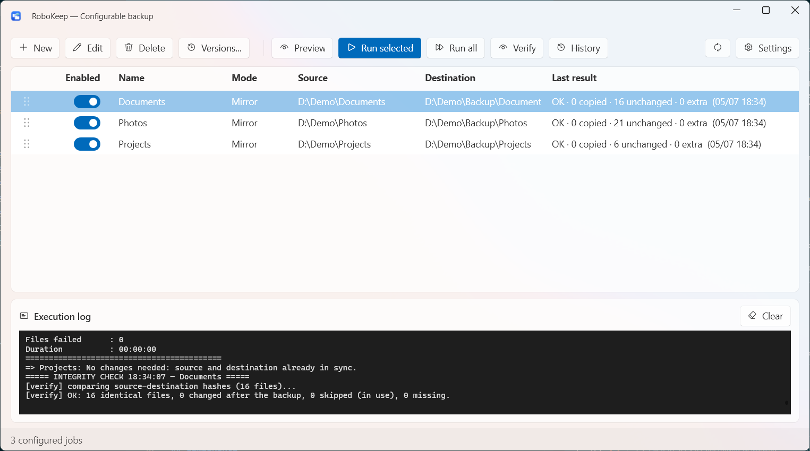
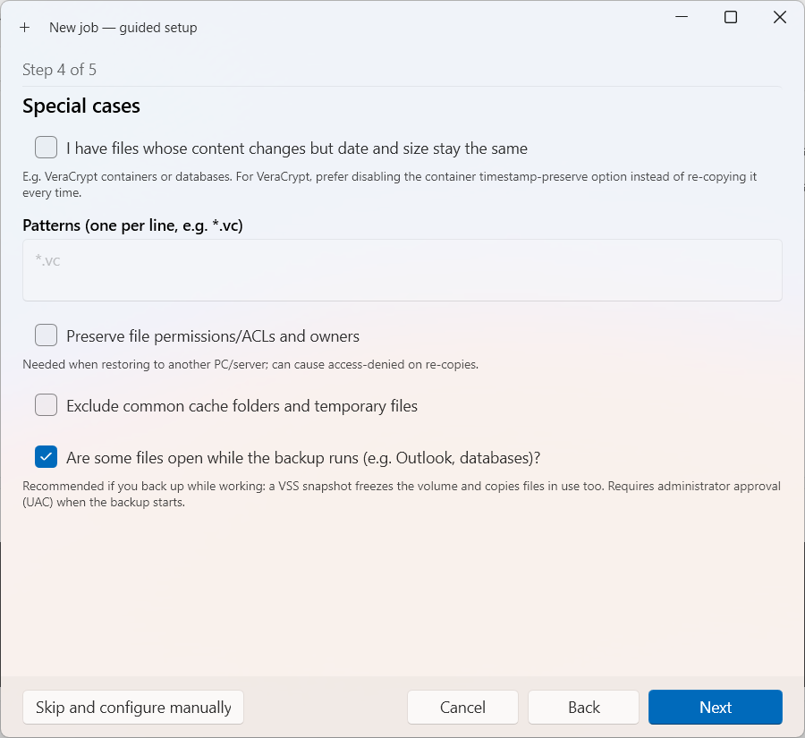
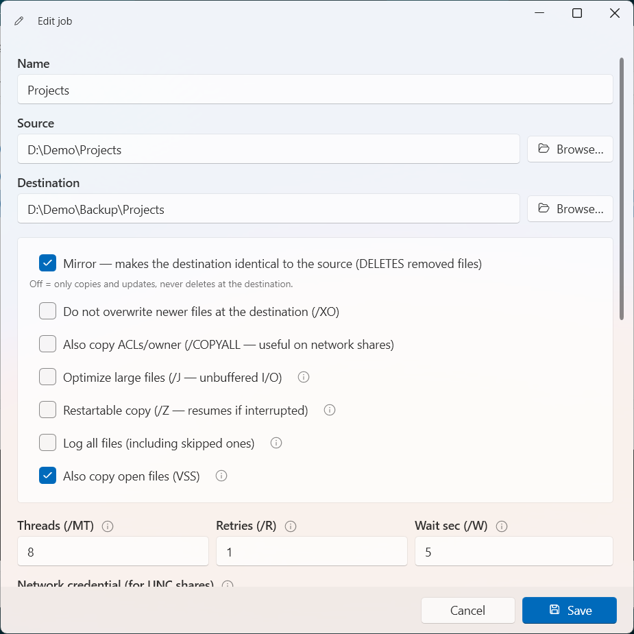
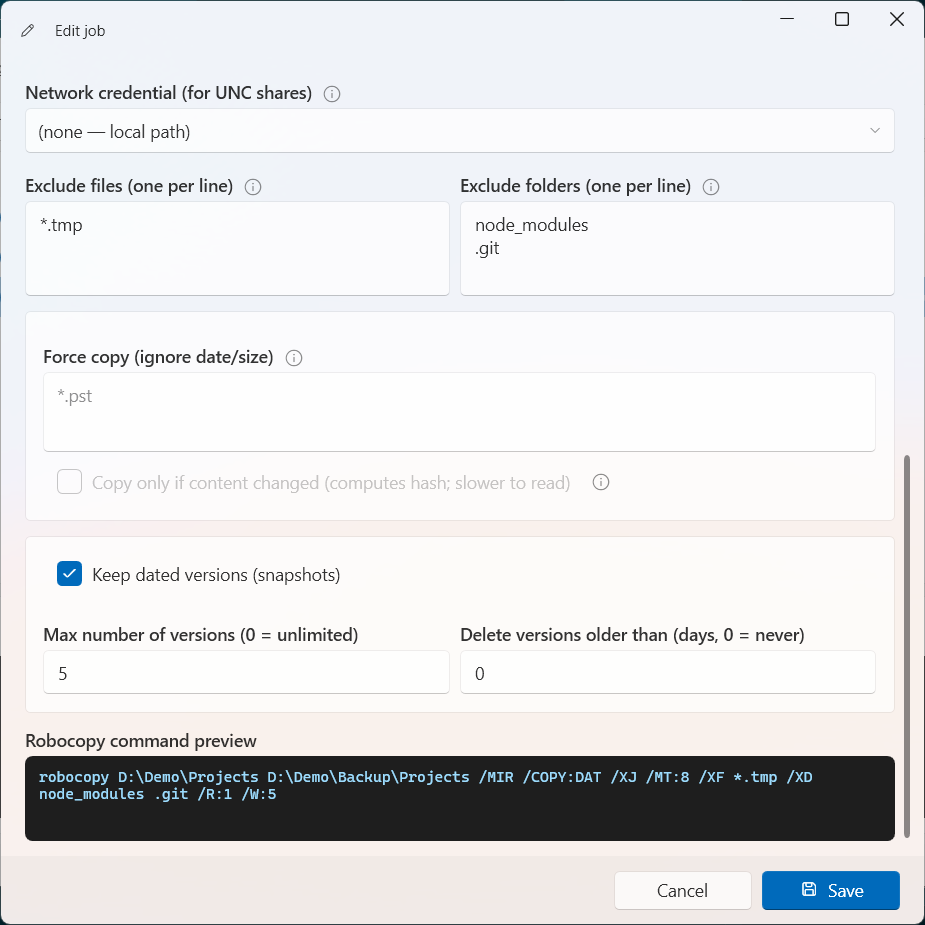
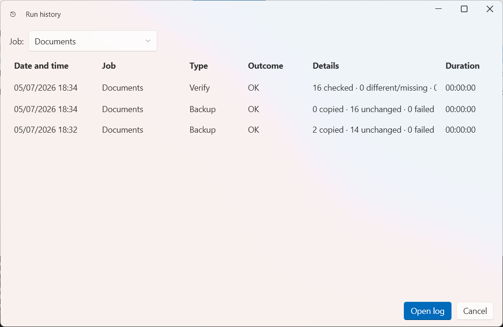
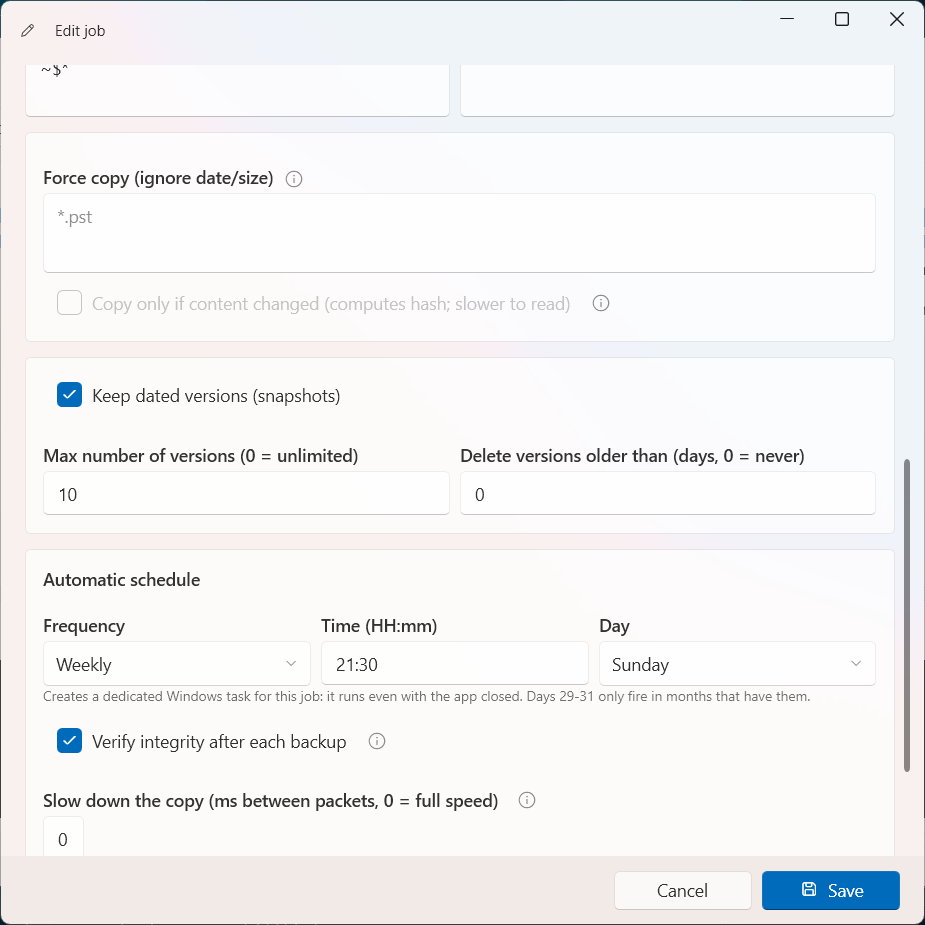
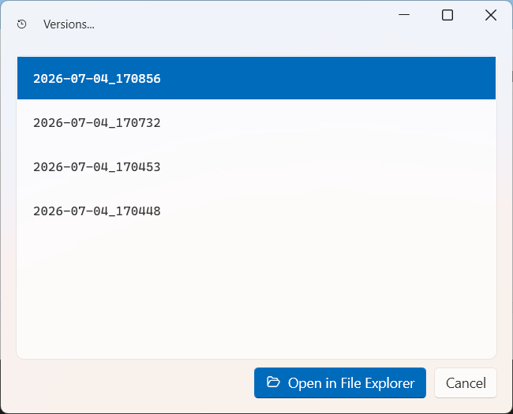

# RoboKeep

*Leer en: [English](README.md) · [Italiano](readmeita.md) · Español · [Français](readmefr.md) · [Deutsch](readmede.md)*

**Configúralo una vez — cada archivo, cada versión, a salvo en tu propio disco.**


[](LICENSE)
[](../../releases)

RoboKeep es una aplicación de Windows amigable que convierte `robocopy` — el motor de copia
sólido como una roca ya incluido en cada PC con Windows — en una **auténtica herramienta de
copia de seguridad**: configuración con un par de clics, **versiones fechadas** de tus archivos,
copia de los **archivos que aún estás usando**, cada tarea con **su propio horario**, un
**historial** completo y la **prueba matemática** de que tus copias están intactas. ¿Alternas
dos discos externos que Windows llama a ambos `E:`? RoboKeep mantiene cada tarea en **su propio
disco** y nunca hace el espejo sobre el equivocado. **Sin nube, sin cuenta, sin suscripción** —
tus archivos nunca salen de tus discos.



## Por qué te gustará

- 🧙 **Responde unas preguntas, obtén la copia adecuada.** No necesitas saber de robocopy: la
  configuración guiada pregunta sobre tus discos y tus datos en lenguaje sencillo y elige por ti
  los ajustes óptimos. Los expertos pueden seguir ajustándolo todo a mano.
- 🛡️ **¿Rotas discos de copia? Nunca escribe en el equivocado** *(novedad en 1.5)*. Si alternas
  dos discos externos, Windows suele darles la **misma letra** (`E:`) — y una tarea en espejo
  dirigida al equivocado podría borrarlo. RoboKeep reconoce cada disco por su verdadera
  **identidad**, no por su letra, y simplemente **omite** la tarea cuando en la ranura no está el
  disco al que pertenece: sin error, sin borrar nada. Reconecta el disco correcto y todo sigue
  donde lo dejaste — los iconos se actualizan en el instante en que lo enchufas.
- 🕰️ **Una máquina del tiempo para tus archivos.** Cada ejecución puede guardar una **versión
  fechada** de tu copia. ¿Borraste un párrafo el martes pasado? Abre la versión del martes y lo
  recuperas. El truco inteligente: los archivos sin cambios se *comparten* entre versiones, así
  diez versiones no cuestan diez veces el espacio — solo lo que realmente cambió.
- 🔓 **Copia archivos incluso mientras los usas** *(novedad en 1.3)*. Archivos de Outlook, bases
  de datos, archivos bloqueados por otros programas: con una casilla, RoboKeep fotografía el
  disco por un instante (una "instantánea de volumen" de Windows) y copia desde esa imagen
  congelada. Y si la instantánea no es posible, la copia simplemente continúa de forma normal —
  nunca se bloquea.
- ✅ **La prueba matemática de que tu copia está intacta** *(novedad en 1.4)*. El botón
  **Verificar** relee cada archivo en ambos lados y compara sus huellas digitales (SHA-256): la
  corrupción silenciosa del disco — invisible a cualquier control de fecha o tamaño — queda al
  descubierto. Y con inteligencia: un archivo que editaste *después* de la copia se señala como
  tal, nunca como una falsa alarma. A demanda, o automática tras cada copia en tus tareas
  críticas.
- ⏰ **Cada tarea con su propio horario** *(novedad en 1.4)*. Documentos cada tarde, fotos el
  domingo, archivos una vez al mes: cada tarea tiene su propia tarea programada de Windows y se
  ejecuta incluso con la app cerrada.
- 📜 **La memoria de cada ejecución** *(novedad en 1.4)*. La ventana **Historial** enumera cada
  copia y cada verificación con resultado, recuentos y duración — y un doble clic abre el
  registro completo dentro de la app, sin hurgar en archivos zip.
- 🚨 **Te avisa cuando algo va mal — y solo entonces.** Una copia que falla en silencio es peor
  que ninguna copia. RoboKeep marca cada tarea problemática con un icono de color — rojo para
  fallida, ámbar para "sin ejecutar demasiado tiempo", naranja para "quedó interrumpida", gris
  para "esperando su disco" — con una explicación clara al pasar el ratón. Y no te da la lata por
  una tarea cuyo disco simplemente has desconectado: eso es un reloj de arena, no una alarma.
- 🔍 **Nada oculto.** El editor siempre muestra el **comando exacto** que se ejecutará. Puedes
  previsualizar cualquier copia (una "ejecución en seco") para ver qué se copiaría o borraría,
  antes de tocar nada.
- 🏠 **Realmente tuyo.** Gratis y de código abierto (MIT), totalmente local, sin telemetría.
  Habla italiano, inglés, español, francés y alemán. Portátil, si lo quieres.

## Míralo en acción

| | |
|---|---|
|  | **Configuración guiada.** Unas preguntas en lenguaje sencillo — incluida la de si los archivos quedan abiertos mientras trabajas — y el asistente configura la tarea por ti. |
|  | **Todo bajo control.** Espejo o acumular, copia de archivos abiertos, opciones para archivos grandes: cada elección explicada en una línea, con una pista donde importa. |
|  | **Transparencia total.** Versiones fechadas con limpieza automática, exclusiones por tarea y el comando robocopy exacto siempre a la vista. |
|  | **Cada ejecución registrada.** Copias y verificaciones una al lado de la otra, filtrables por tarea; doble clic en cualquier entrada para leer su registro completo sin tocar un zip. |
|  | **Configúralo y olvídate.** Cada tarea puede tener su propio horario — diario, semanal o mensual — más la verificación de integridad automática tras cada ejecución. |
|  | **Vuelve atrás en el tiempo.** Elige una fecha, un clic, y la copia de ese día se abre en el Explorador de archivos. Recupera lo que necesites. |

## Empieza en dos minutos

1. Descarga la última versión desde la página de **[Releases](../../releases)**:
   - **`…-selfcontained.zip`** — extrae y ejecuta, **nada que instalar** (incluye .NET, descarga más grande);
   - **`…-framework-dependent.zip`** — mucho más pequeño, necesita el
     [.NET 10 Desktop Runtime](https://dotnet.microsoft.com/download/dotnet/10.0) gratuito, instalado una vez.
2. Extrae el zip en una **carpeta con permisos de escritura** (p. ej. `D:\Programas\RoboKeep` —
   evita `C:\Program Files`).
3. Ejecuta **`RoboKeep.exe`**, pulsa **Nuevo**, responde las preguntas del asistente y luego
   **Ejecutar todo**. Listo.

¿Quieres que se ejecute solo? Da a cada tarea su propio horario directamente en el editor
(diario, semanal o mensual), o usa **Ajustes → Programación** para una única tarea "ejecutar
todo". En cualquier caso, se ejecuta incluso con la app cerrada.

## Cómo se comporta una copia

Para cada tarea (un par carpeta origen → carpeta destino, subcarpetas incluidas), RoboKeep:

- **omite** los archivos que no han cambiado (por eso la segunda ejecución dura segundos);
- **actualiza** los archivos más recientes en el origen;
- en modo **espejo** (predeterminado) también **elimina** del destino lo que borraste del
  origen — el destino sigue siendo una copia exacta;
- con el espejo desactivado, solo añade y actualiza, **nunca elimina**.

Y si activaste las versiones, cada ejecución guarda primero el estado anterior como una
instantánea fechada.

## Todas las funciones

**Copia de seguridad**
modo espejo o acumular · **protección de rotación de discos: una tarea se ejecuta solo en su
disco, identificado por volumen — nunca hace el espejo sobre el equivocado o ausente** ·
versiones fechadas con enlaces duros y retención configurable · copia de archivos
abiertos/bloqueados mediante VSS · **verificación de integridad (SHA-256), a demanda o tras cada
ejecución** · copia multihilo · exclusiones de archivos y carpetas por tarea · "forzar copia"
para archivos cuya fecha/tamaño nunca cambian (contenedores cifrados, algunas bases de datos),
con un modo opcional de comparación por contenido · modo reanudable para archivos enormes ·
vista previa/ejecución en seco

**Te mantiene informado**
**historial de ejecuciones con visor de registros integrado** · iconos de salud por tarea con
explicaciones en lenguaje sencillo, incluido un estado neutro "esperando su disco" · **iconos
que se actualizan en el instante en que conectas o desconectas un disco** · comprobaciones
previas (destino accesible, espacio en disco, idoneidad de VSS y versiones) · registro en tiempo
real · archivo de registros comprimidos por tarea con limpieza automática · notificaciones y
bandeja del sistema · informes por correo (SMTP), opcionalmente solo en caso de errores

**Se adapta a ti**
asistente guiado o editor manual completo · vista previa exacta del comando · **programación por
tarea (diaria / semanal / mensual)** · recursos de red con credenciales cifradas (DPAPI de
Windows) · **limitación de velocidad de copia para copias en red** · **exportar/importar
configuración** · línea de comandos para automatización · reordenar tareas arrastrando ·
5 idiomas · modo portátil

## Bueno saberlo

- **Solo Windows 10/11** — RoboKeep se apoya en robocopy y otras funciones nativas de Windows.
- **Los archivos cambiados se recopian enteros** (sin copia por bloques/delta): perfecto para
  documentos y fotos, costoso para archivos enormes que cambian a diario.
- **Los discos en rotación se reconocen por identidad, no por letra.** Vincula una tarea a su
  disco en el editor (**Proteger con este disco**); a partir de ahí la tarea se omite siempre que
  en la ranura haya un disco distinto — o ninguno — para que nunca haga el espejo sobre el
  equivocado. Las tareas en destinos internos o de red no lo necesitan y no se ven afectadas.
- **Las versiones requieren un destino NTFS local** (los enlaces duros no existen en exFAT ni en
  recursos de red).
- **La copia de archivos abiertos requiere un origen NTFS local** y pide una confirmación de
  administrador (UAC) por ejecución.
- **Las verificaciones de integridad releen cada archivo en ambos lados**: minuciosas por
  diseño, así que espera que una verificación dure más o menos como una primera copia. Activa
  "verificar tras cada copia" solo donde importe.
- Tus ajustes, resultados y registros viven en `%APPDATA%\RoboKeep`, así que sobreviven a las
  actualizaciones de la app. Las contraseñas se cifran con DPAPI de Windows, nunca se guardan en
  texto plano. Nota: el ámbito de cifrado predeterminado es **a nivel de máquina** (para que las
  tareas programadas también puedan descifrarlas) — en un PC compartido, cambia el ajuste al
  ámbito por usuario si otras cuentas no deberían poder leerlas.

## Privacidad

RoboKeep no recopila **nada**. Sin telemetría, sin analíticas, sin comprobaciones de
actualización, sin cuenta, sin tráfico de red en absoluto a menos que *tú* configures los
informes por correo (servidor SMTP de tu elección — TLS activado por defecto). Todo lo que la
app sabe — ajustes de las tareas, resultados, historial, registros — vive en archivos locales de
tu PC, JSON legible que puedes inspeccionar en cualquier momento. Los registros contienen las
rutas de los archivos copiados y se limpian automáticamente tras 30 días (configurable).

## Para usuarios avanzados

```text
RoboKeep.exe --run-all              ejecuta todas las tareas habilitadas (código de salida 0 = todo bien)
RoboKeep.exe --job "Documentos"     ejecuta una sola tarea
RoboKeep.exe --run-all --dry-run    solo vista previa, sin cambios
RoboKeep.exe --job "Fotos" --config "D:\ruta\config.json"
```

Compilar desde el código: `dotnet build src/RoboKeep.sln -c Release` (requiere el SDK de
.NET 10) — la batería de pruebas se ejecuta con `dotnet test src/RoboKeep.Tests/RoboKeep.Tests.csproj`.
Modo portátil: crea un archivo vacío `portable.flag` junto al exe y todo (configuración,
registros, resultados) se queda en la carpeta de la app. Configuración de ejemplo:
[config/config.example.json](config/config.example.json). Contexto del proyecto y decisiones
técnicas: [ANALISI.md](ANALISI.md) *(en italiano)*.

## Licencia

Distribuido bajo la **Licencia MIT** — consulta [LICENSE](LICENSE). Los componentes de terceros
se enumeran en [THIRD-PARTY-NOTICES.md](THIRD-PARTY-NOTICES.md). © 2026 Roberto Serafini.
